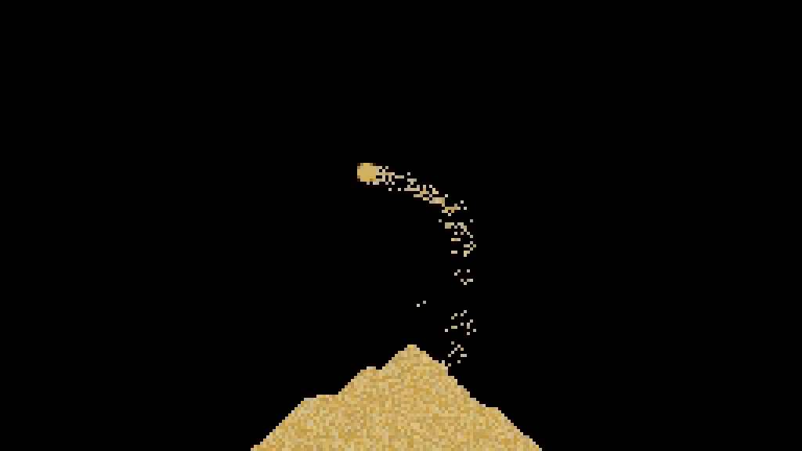

# Falling Sand

[Demo](https://sandfall.netlify.app/)



## Status

This is very WIP. I am following through some content before porting to my [ECS](https://github.com/jakeklassen/ecs).

## Recordings

Press `r` to start recording, `r` again to stop recording. The recording will be saved as `sand.webm`. MediaRecorder is used to record the canvas.

⚠️ The recording is not _ready_ to play on _all_ media players, you should run it through `ffmpeg` to fix it.

For example I like to scale it up:

```bash
ffmpeg -i "sand.webm" -vf scale=1024:576:flags=neighbor -r 60 sand-output.webm
```

## Performance

Currently, the simulation is locked to 60 FPS.

## Kudos

**Heavily** inspired by Jason McGhee's [Falling Sand series](https://jason.today/falling-sand).
